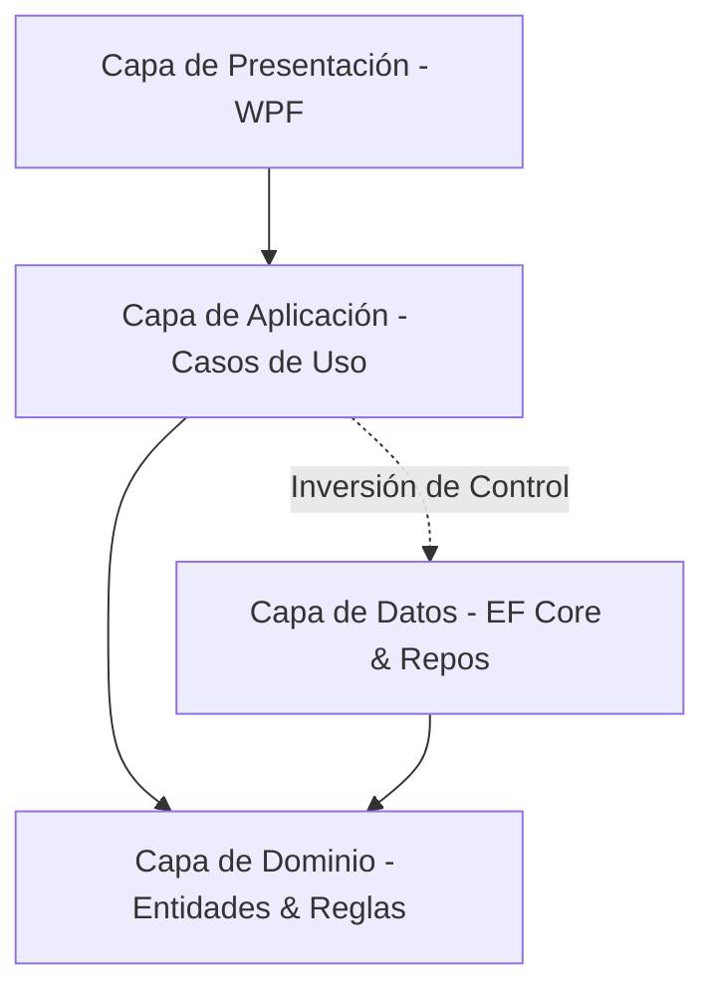

# Sistema de Gestión Gastronómica

Sistema de escritorio para la administración y operación de locales de venta de dulces artesanales, desarrollado en **C# / .NET 8** utilizando **WPF** y **Entity Framework Core** sobre **SQL Server**, aplicando principios de **Arquitectura en Capas**.

---

## Índice

1. [Descripción del Proyecto](#-descripción-del-proyecto)
2. [Stack Tecnológico](#-stack-tecnológico)
3. [Arquitectura](#-arquitectura)
4. [Estructura del Proyecto](#-estructura-del-proyecto)
5. [Requisitos Previos](#-requisitos-previos)
6. [Configuración y Ejecución](#-configuración-y-ejecución)
7. [Datos Semilla (Seeder) y Credenciales de Prueba](#-datos-semilla-seeder-y-credenciales-de-prueba)
8. [Documentación Adicional](#-documentación-adicional)

---

## Descripción del Proyecto

La aplicación permite gestionar el flujo integral de un comercio de dulces artesanales:
- Autenticación y control de accesos por roles (Administrador, Cocinero, Vendedor).
- Punto de venta y toma de pedidos.
- Gestión de productos, cartas y categorías.
- Control de stock de insumos.
- Monitor de cocina para despacho de pedidos.
- Reportes operativos y estadísticos.

---

## Stack Tecnológico

- **Lenguaje & Plataforma**: C# / .NET 8 (Windows)
- **UI / Frontend**: WPF (Windows Presentation Foundation) con MVVM
- **Persistencia / ORM**: Entity Framework Core 8
- **Seguridad**: Hashing con BCrypt
- **Base de Datos**: Microsoft SQL Server

---

## Arquitectura

El proyecto está diseñado bajo una **Arquitectura en Capas** estricta, desacoplada mediante inversión de dependencias:



- **Dominio**: Núcleo puro del negocio sin dependencias externas.
- **Aplicación**: Orquestación de casos de uso y DTOs.
- **Datos**: Implementación de repositorios, configuración de EF Core, migraciones y seeder.
- **Presentación**: Vistas XAML, controles y ViewModels.

Para más detalle, consultar [architecture.md](architecture.md).

---

## Estructura del Proyecto

```text
├── Dominio/               # Entidades de negocio, Value Objects e interfaces de repositorio
│   ├── Entidades/         # Usuario, Rol, etc.
│   └── Interfaces/        # IRolRepositorio, IUsuarioRepositorio
├── Aplicacion/            # Casos de uso y lógica de aplicación
│   ├── CasosDeUso/        # CrearUsuario, IniciarSesion, etc.
│   └── DTOs/              # Data Transfer Objects
├── Datos/                 # Acceso a datos, persistencia y mapeos
│   ├── Conexion/          # AppDbContext y fábrica de conexiones
│   ├── Migrations/        # Migraciones de EF Core
│   ├── Repositorios/      # Implementación de repositorios sobre EF Core
│   └── Seeder/            # Inicializador idempotente de datos base
└── Presentacion/          # Interfaz de usuario WPF
    ├── ViewModels/        # ViewModels MVVM
    ├── Vistas/            # Vistas XAML (Login, MenuPrincipal, etc.)
    └── App.xaml.cs        # Punto de entrada e inyección de dependencias
```

---

## Requisitos Previos

- [.NET 8 SDK](https://dotnet.microsoft.com/download/dotnet/8.0)
- [Microsoft SQL Server](https://www.microsoft.com/es-es/sql-server/sql-server-downloads)
- [Visual Studio 2022](https://visualstudio.microsoft.com/)

---

## Configuración y Ejecución

1. **Cadena de Conexión**:
   Verificar o ajustar la cadena en [Datos/Conexion/AppDbContext.cs](Datos/Conexion/AppDbContext.cs):
   ```csharp
   public const string ConnectionString =
       "Server=localhost\\SQLEXPRESS;Database=ProyectoCRUD;Trusted_Connection=True;TrustServerCertificate=True;";
   ```

2. **Compilar la Solución**:
   ```bash
   dotnet build
   ```

3. **Ejecutar la Aplicación**:
   ```bash
   dotnet run --project Presentacion/Presentacion.csproj
   ```
   *(Al iniciar por primera vez, el sistema aplica automáticamente las migraciones pendientes y ejecuta el seeder de base de datos).*

---

## Datos Semilla (Seeder) y Credenciales de Prueba

Al iniciar la aplicación, el `DatabaseSeeder` verifica e inserta automáticamente los roles base y usuarios de prueba si aún no existen:

| Rol | Email | Contraseña | Perfil / Acceso |
| :--- | :--- | :--- | :--- |
| **Admin** | `admin@test.com` | `admin123` | Acceso completo (usuarios, productos, stock, reportes) |
| **Cocinero** | `cocinero@test.com` | `cocina123` | Acceso a vista de cocina y despacho de comandas |
| **Vendedor** | `vendedor@test.com` | `vendedor123` | Acceso a punto de venta y toma de pedidos |

> **Nota de Seguridad**: Todas las contraseñas se almacenan encriptadas con **BCrypt** mediante el caso de uso y el ORM.

---

## Documentación Adicional

- [Guía de Arquitectura (architecture.md)](architecture.md)
- [Guía de Diseño y UI (design.md)](design.md)
- [Diagrama Entidad-Relación (DER)](DER_Grupo24_Hardoy-Harvey.png)
- [Especificación de Requerimientos de Software (ERS)](ERS_Grupo24_Hardoy-Harvey.pdf)
