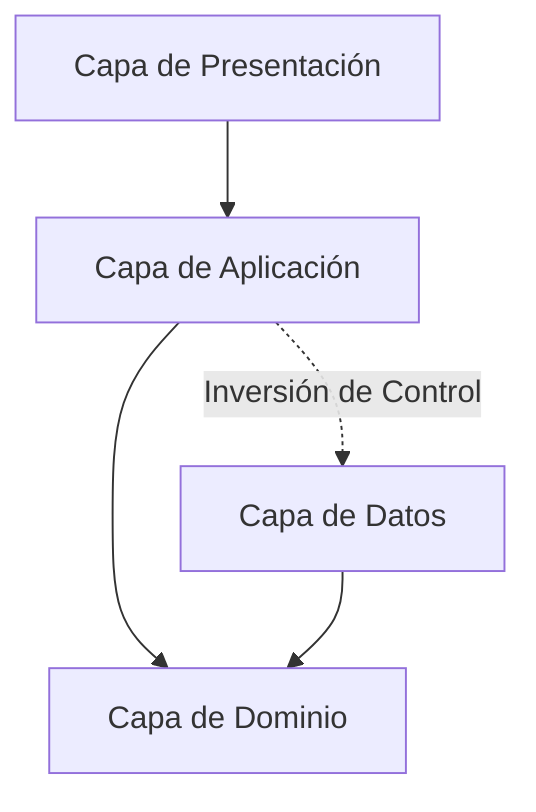

# Arquitectura del Sistema: Arquitectura en Capas

Este documento describe la arquitectura en capas adoptada para el proyecto, detallando el rol de cada capa, sus responsabilidades, dependencias y flujo de datos.

---

## 1. Visión General

El sistema implementa una **Arquitectura en Capas** con enfoque en la separación de responsabilidades y el desacoplamiento. Las dependencias fluyen estrictamente hacia adentro, situando el modelo del negocio y sus abstracciones en el núcleo.

---

## 2. Descripción de las Capas

### 2.1. Dominio (`Dominio/`)
Representa el núcleo de la lógica del negocio. Es totalmente independiente de frameworks, bases de datos y detalles de interfaz gráfica.

- **`Entidades/`**: Modelos de negocio con identidad única y ciclo de vida propio.
- **`ValueObjects/`**: Objetos inmutables definidos por sus atributos en lugar de una identidad.
- **`Enumeraciones/`**: Tipos enumerados que restringen estados o clasificaciones del dominio.
- **`Servicios/`**: Lógica de dominio pura que involucra múltiples entidades o no pertenece naturalmente a una sola entidad.
- **`Interfaces/`**: Contratos (interfaces) de repositorios y servicios externos requeridos por el dominio (Inversión de Dependencias).

---

### 2.2. Aplicación (`Aplicacion/`)
Orquesta los flujos de trabajo de la aplicación y coordina la ejecución de las reglas del negocio.

- **`CasosDeUso/`**: Implementación de los casos de uso específicos del sistema (acciones que el usuario o un sistema externo puede ejecutar).
- **`Servicios/`**: Servicios de aplicación que coordinan transacciones, validaciones de entrada y flujos de alto nivel.
- **`DTOs/`** (*Data Transfer Objects*): Estructuras de datos planas utilizadas para transferir información entre la capa de presentación y la de aplicación sin exponer entidades de dominio.
- **`Interfaces/`**: Contratos de servicios de aplicación y adaptadores.

---

### 2.3. Datos (`Datos/`)
Maneja la persistencia y la interacción con fuentes de datos externas o infraestructura.

- **`Conexion/`**: Configuración y gestión de conexiones a bases de datos o servicios externos.
- **`Repositorios/`**: Implementaciones concretas de las interfaces de repositorio definidas en `Dominio/Interfaces` o `Aplicacion/Interfaces`.
- **`Mappings/`**: Mapeo entre entidades de dominio y esquemas/tablas relacionales (ORM / Data Mappers).
- **`Migrations/`**: Control de versiones y scripts de migración del esquema de base de datos.

---

### 2.4. Presentación (`Presentacion/`)
Punto de entrada de interacción con el usuario. Se encarga de capturar eventos, mostrar datos y delegar acciones a la capa de aplicación.

- **`Vistas/` & `Formularios/`**: Componentes visuales y ventanas principales de la interfaz.
- **`Controles/`**: Componentes visuales reutilizables.
- **`ViewModels/`**: Adaptación del estado y comandos de UI para desacoplar las vistas de la lógica de aplicación (patrón MVVM / Presenter).

---

## 3. Reglas de Dependencia y Buenas Prácticas

1. **Flujo de Dependencias Unidireccional**:
   - `Presentacion` depende de `Aplicacion` (y de contratos o DTOs).
   - `Aplicacion` depende de `Dominio`.
   - `Datos` implementa interfaces de `Dominio` o `Aplicacion`.
   - `Dominio` **no debe tener dependencias** de ninguna otra capa ni de librerías de infraestructura externa.
2. **Uso de DTOs**: La capa de `Presentacion` nunca debe manipular entidades directas de `Dominio` para operaciones de lectura/escritura en la UI, garantizando el encapsulamiento.
3. **Inversión de Dependencias (DIP)**: La capa de `Aplicacion` interactúa con los repositorios a través de interfaces, permitiendo sustituir o testear la capa de `Datos` sin modificar la lógica del negocio.
